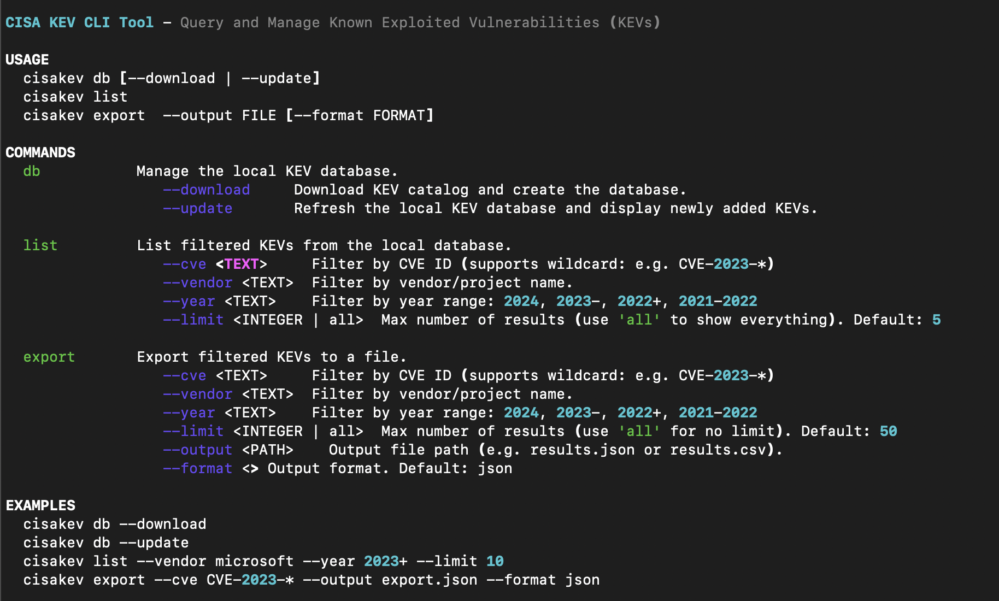
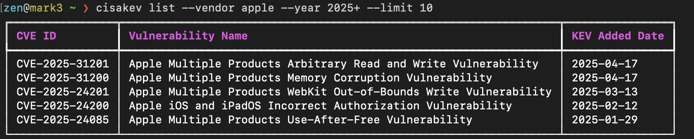
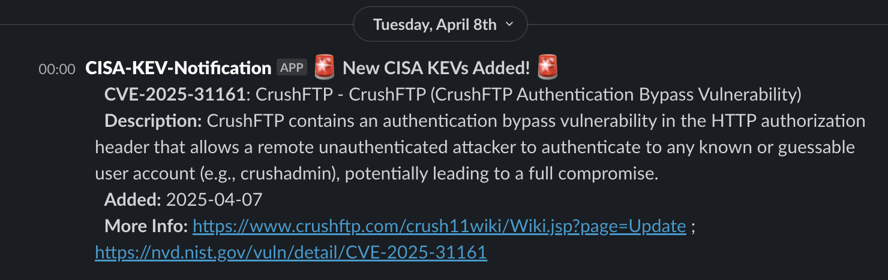
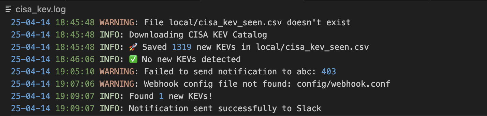

# CISA KEV

A modular Python-based threat intelligence project centered around the [CISA Known Exploited Vulnerabilities (KEV) catalog](https://www.cisa.gov/known-exploited-vulnerabilities-catalog). The goal is to create an extensible system for tracking, enriching, and acting on KEV data for defenders, CTI analysts, and researchers.

This project is divided into multiple sub-projects/modules.


## 🧩 Sub-Projects

### 1. KEV Watcher

A monitoring module that detects when new entries appear in the CISA KEV catalog and notifies via webhook.

#### 🔧 Features

- 🛡️ Detects new KEV entries automatically
- 🔔 Sends alerts to Slack or other webhook-compatible services
- ⏱️ Supports both cron and manual execution
- 🧠 Designed for future enrichment and integration with threat intelligence workflows

#### 📦 Requirements

- Python 3.6+
- Required libraries: `requests`, `rich`, `tabulate`

Install requirements manually (if not using editable install):

```bash
pip install -r requirements.txt
```

### ⚡ Simple Watcher

The simplest form of a CISA KEV Watcher: it fetches the latest KEV list, detects new entries, and sends alerts to configured webhooks.

If you don't need all the extra features, this version is designed for quick integration into automation and monitoring workflows.

```
simple/cisa_kev_watcher.py
```


### ⚙️ Configuration

Webhook configuration is required for notifications. Add webhook URLs.

`config/webhook.conf`

```conf
Slack=https://hooks.slack.com/services/XXX/YYY/ZZZ
TeamsA=https://your-teamsa-webhook-url
TeamsB=https://your-teamsb-webhook-url
```


### ⏰ Cronjob

Set up a cronjob to monitor new KEVs regularly.

Example: run every hour

```cron
0 * * * * /usr/bin/python3 /opt/cisakev/simple/cisa_kev_watcher.py
```

> Use full path for `python3` and your project directory to avoid environment issues with cron.

> [!TIP]
> Added Product Blacklist Support:
> You can now filter out products you don't want to receive notifications.
> - Create or edit the file at `config/product_blacklist.txt` and list vendor-project or product or combinations of both. 
>   - e.g., `Apple` or `fortinetfortios` or `ColdFusion` one per line.
> - The system defaults to `blacklist` mode. You can also switch to `whitelist` if needed.


### 2. CLI Tool
### 🚀 Full Installation

1. Clone the repository:
   ```bash
   git clone https://github.com/zen29d/cisakev.git
   cd cisakev
   ```

2. (Optional) Create and activate a virtual environment:
   ```bash
   python3 -m venv pycisa
   source pycisa/bin/activate
   ```

3. Install the package locally:
   ```bash
   pip install .
   ```


### 🖥️ Usage

### ✅ CLI Execution

Run CLI directly from the shell after installing:

```bash
cisakev
```




#### 🔎 CLI Query Support

The CLI provides a flexible query system against the locally stored KEV database.

Example usage:

```bash
cisakev list --cve CVE-2023-12345
cisakev list --vendor "Cisco"
cisakev list --date "2025-03-15"
```

#### CLI Help

```bash
cisakev
cisakev --help
cisakev list --help
```


#### Example Output




## 🛠️ Features in Progress

- [ ] **CVE Enrichment**  
  Augment KEV data with additional intelligence from:
  - NVD
  - CVSS / CWE scores
  - References and exploitability metadata

- [x] **CLI and Queryable Data**
  - CLI tool
  - Uses SQLite for fast lookup and filtering
  - Export options and stats available

- [ ] **Public PoC Scraper**  
  Automatically search for public PoCs from:
  - GitHub (using GitHub API)
  - ExploitDB
  - Other OSINT sources

- [ ] **Web UI**


## 🔔 Notifications

Slack/webhook alerts will display the latest added KEVs, their CVE IDs, vendors, and brief summaries.




## 📝 Logging

The system provides rich logs for terminal or file output (ideal for cron):




## ✅ Ideal For

- Internal vulnerability tracking
- Security team alerting
- Threat intelligence workflows
- SOC automation pipelines
- Home labs and CTI research environments

## Version

- Version: 1.0.4_alpha

Part of ongoing CVE automation research and threat intelligence tooling